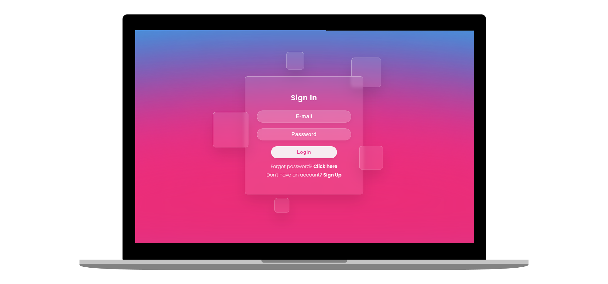

<h1 align="center">
    
</h1>

<h3 align="center">
  Epic Task
</h3>

 
 

  <a href="#sobre">Sobre</a>&nbsp;&nbsp;&nbsp;|&nbsp;&nbsp;&nbsp;
  <a href="#layout">Layout</a>&nbsp;&nbsp;&nbsp;|&nbsp;&nbsp;&nbsp;
  <a href="#tecnologias">Tecnologias</a>&nbsp;&nbsp;&nbsp;|&nbsp;&nbsp;&nbsp;
  <a href="#licença">Licença</a>

  

## Sobre 

'EpicTask ' é um projeto desenvolvido para o primeiro Checkpoint do segundo semestre da disciplina de Digital Business Enablement. Trata-se de um sistema web, criado através do framework Spring, o projeto visa o cadastro de task's (tarefas) para seus usuários, que poderão concluí-las através de uma "gamificação" na plataforma.

#### Integrantes do grupo:
Carolina Gomes da Silva - RM85183  
Élida Coelho da Silva - RM85599  
João Carlos Silva Muniz - RM86392  
Luana Cunha Hitomi Maruya e Silva - RM86039  
Maurício Martins - RM86035  
Pedro Miguel de Sousa Barbosa dos Santos - RM86396

## Layout

Você pode visualizar o layout do projeto através [desse link](https://www.figma.com/file/0woFnDc2NDnadwLJdJb36k/Untitled?node-id=0%3A1).

## Tecnologias

Esse projeto foi desenvolvido com as seguintes tecnologias:

- [Spring Framework](https://spring.io/)
- [Thymeleaf](https://www.thymeleaf.org/)
- [Maven](https://maven.apache.org/)
- [Lombok](https://projectlombok.org/)
- [Swagger](https://swagger.io/)
- [JPA](https://spring.io/projects/spring-data-jpa)
- [SQL Developer](https://www.oracle.com/tools/downloads/sqldev-downloads.html)

## Licença

Esse projeto está sob a licença MIT. Consulte o arquivo [LICENSE](https://github.com/pedromiguelsbs/EpicTask/blob/main/LICENSE) para mais detalhes.
